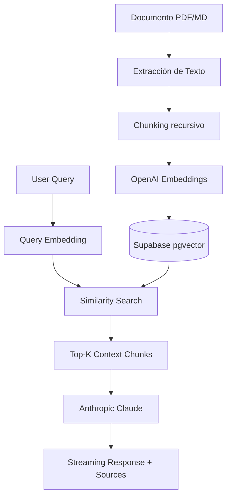

# P05 — Docs Chat 📄💬

> Una plataforma moderna de **RAG (Retrieval-Augmented Generation)** para conversar con tus documentos con precisión quirúrgica y atribución de fuentes.

[](https://nextjs.org/)
[](https://www.typescriptlang.org/)
[](https://supabase.com/)
[](https://tailwindcss.com/)
[](https://openai.com/)
[](https://anthropic.com/)

---

## 🚀 Características Principales

*   **Ingesta Inteligente:** Procesamiento automático de archivos **PDF y Markdown** con extracción de texto limpio.
*   **Búsqueda Semántica:** Implementación de `pgvector` en Supabase para una recuperación de fragmentos extremadamente rápida y relevante.
*   **Atribución de Fuentes:** Cada respuesta generada incluye los fragmentos exactos utilizados y un **Score de Confianza** basado en similitud vectorial.
*   **Gestión de Contexto:** Selección dinámica de documentos para focalizar la conversación en fuentes específicas.
*   **Streaming UI:** Respuestas en tiempo real con una interfaz moderna construida sobre `shadcn/ui`.

---

## 🛠️ Stack Tecnológico

- **Frontend:** Next.js 16 (App Router), TypeScript, Tailwind CSS, shadcn/ui.
- **Base de Datos:** Supabase + `pgvector` para almacenamiento vectorial.
- **Embeddings:** OpenAI `text-embedding-3-small`.
- **LLM:** Anthropic `claude-sonnet-4-6` (vía SDK oficial).
- **Procesamiento:** LangChain (Recursive Character Splitting), `pdf-parse`.

---

## 🧠 El Pipeline RAG



---

## ⚙️ Configuración

### Requisitos Previos

- Node.js 20+
- Cuenta en Supabase con pgvector habilitado
- API Keys de OpenAI y Anthropic

### Instalación

1. Clonar el repositorio
2. Instalar dependencias:
   ```bash
   npm install
   ```
3. Configurar variables de entorno (`.env.local`):
   ```env
   NEXT_PUBLIC_SUPABASE_URL=tu_url
   NEXT_PUBLIC_SUPABASE_ANON_KEY=tu_key
   OPENAI_API_KEY=tu_openai_key
   ANTHROPIC_API_KEY=tu_anthropic_key
   MATCH_THRESHOLD=0.5
   ```
4. Ejecutar el servidor de desarrollo:
   ```bash
   npm run dev
   ```

---

## 🏗️ Estructura del Proyecto

- `app/api/`: Ruteo de API para ingestión, búsqueda y chat por streaming.
- `lib/supabase/`: Configuración del cliente y tipos de base de datos.
- `components/`: UI basada en componentes atómicos de shadcn.
- `supabase/migrations/`: Esquema de la base de datos (documents, document_chunks).

---

## 🎓 Contexto Académico

Este es el **Proyecto 05** del currículum *Full Stack AI Developer*. Representa la culminación de la **Fase 3: RAG y Pipelines de Conocimiento**, donde se abordan los desafíos de contextualización, balance de chunks y recuperación precisa de información técnica.
